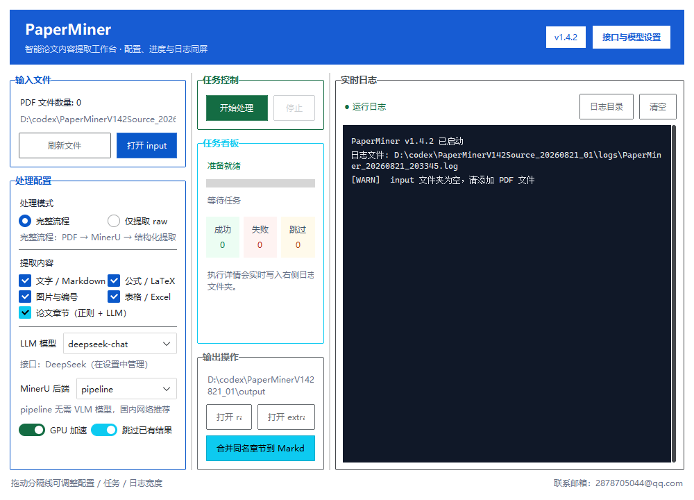
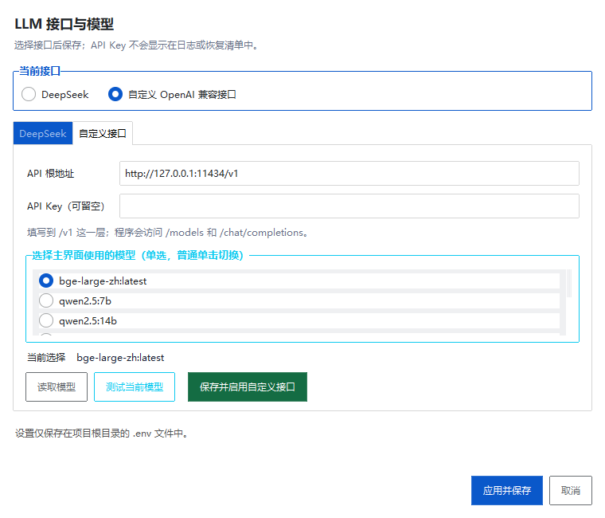

# PaperMiner

> 面向科研工作者的 Windows 论文内容提取工作台：批量处理 PDF，并把正文、公式、图片、表格和论文章节整理成可继续编辑的 Markdown、Excel 与 Word 文件。

[](https://github.com/Given-Dream/PaperMiner/releases/latest)
[](#系统要求)
[](#从源码运行)
[](docs/LICENSE)

当前版本：**v1.4.14** · [下载 PaperMiner v1.4.14](https://github.com/Given-Dream/PaperMiner/releases/tag/v1.4.14)



## 适合做什么

PaperMiner 以 MinerU 为解析后端，在一个界面中完成 PDF 批处理、结构化提取与结果归档。它适合把论文转换为可检索、可引用、可二次加工的个人素材库。

| 能力 | 输出 |
| --- | --- |
| 正文提取 | 修复资源路径后的 Markdown |
| 图片提取 | JPG/PNG、图号识别与映射表 |
| 表格提取 | 表格图片与 Excel（`.xlsx`） |
| 公式提取 | 公式图片与 LaTeX 汇总 |
| 章节归类 | `Abstract`、`Introduction`、`Methods`、`Results & Discussion`、`Conclusion` 等独立 Markdown |
| 图表汇总 | 按原文顺序生成 Word 与 Markdown |
| 代码与数据可用性 | 提取文末代码仓库和数据集超链接；只有可信地址才生成可核验 Markdown |

章节归类采用“正则规则优先、LLM 按需补充”的方式。不配置 API 也能工作；配置 DeepSeek 或 OpenAI 兼容接口后，可对缺失或异常章节进行辅助识别。

## v1.4.14 无 Conda 快速确认与按钮顺序

- Setup 完成快速自动检查、未从明确路径或已保存配置找到 Conda 后，立即启用“我确认本机没有 Conda”复选框。
- 用户可以直接确认并进入多镜像 Anaconda 下载流程，不再被要求先执行“检测此目录”或“全盘检索 Conda”。
- 指定目录检测与全盘检索继续保留为可选核查工具；发现可用 Conda 时仍会优先复用，避免重复安装。
- 底部操作顺序调整为“安装”在左、“取消”在右，同时保留 Enter 安装、Esc 取消的键盘习惯。

## v1.4.13 Conda 严格检测与可选全盘检索

- Setup 自动检测改为确定的两级优先顺序：先检查 Setup 明确传入的 Conda 路径，再检查 PaperMiner 已保存的运行环境配置和每用户路径提示。
- 自动阶段不再静默遍历磁盘；没有结果时，界面提供“检测此目录”和“全盘检索 Conda”两个由用户主动触发的入口。
- 全盘检索只读遍历已就绪的本地固定磁盘和可移动磁盘，实时显示当前路径；跳过 Windows、回收站、系统卷、重解析点、`.git` 和 `node_modules`，避免权限阻塞、目录循环和无意义扫描。
- 指定目录和全盘检索发现候选后都会实际执行 `conda --version` 验证。只有检测完成且未找到 Conda，才允许用户确认无 Conda 并进入多镜像下载分支。

## v1.4.11 单实例与完整退出

- `PaperMiner.exe` 使用当前 Windows 会话全局的单实例锁：双击、连续点击、重复启动或从另一份安装目录启动都只打开一个主界面。
- 启动器在后台监护 GUI，并把 GUI 与 MinerU 后代进程纳入关闭即回收的 Windows 作业对象。
- 关闭主界面时先禁止新 MinerU 进程创建，再终止已登记的整个进程树并等待退出；超时则强制结束。
- “停止”按钮及多 GPU 环境级错误也使用相同清理流程，日志会记录清理与确认退出数量。

## v1.4.12 Conda 检测与无 Conda 安装修复

- Conda 检测现在会读取每用户的持久化路径提示、旧 PaperMiner 配置，并补充扫描各磁盘的 `Program Files\Anaconda3`、`Miniconda3` 等常见位置；首次安装失败后再次运行 Setup 也能复用已指定的 Conda。
- 自动检测不到时，Setup 不会直接下载或覆盖目录：先由用户指定 Conda 根目录并点击“检测此目录”；只有勾选“我确认本机没有 Conda”后才允许下载。
- 用户指定的目录支持选择父目录并检查标准 Anaconda/Miniconda 子目录；验证通过后直接复用，不重复下载。
- 确认没有 Conda 后，安装器按清华、北外、南大镜像顺序下载并校验 Anaconda；失败镜像会自动切换，已验证安装包保留供重试。
- 创建 MinerU 环境时使用 `conda-forge --override-channels`，不再因 Anaconda 默认频道未接受服务条款而中途失败；安装日志会记录实际路径和处理分支。

## v1.4.10 安装前 Conda 检测

- Setup 打开后先自动检测现有 Conda，检测完成前不会允许开始安装。
- 检测到时只显示“将直接复用”的 Conda 根目录，Anaconda 安装位置不会出现。
- 只有确认未检测到 Conda 或检测失败时，才显示 Anaconda 目录输入框和浏览按钮。
- 支持“重新检测”；自动检测遗漏时，也可把出现的目录框指向现有 Conda 根目录。

## v1.4.9 新电脑安装更新

- Setup 增加独立的“Anaconda 安装位置”输入框和浏览按钮，PaperMiner 与 Anaconda 均由用户指定目录，且必须使用互不重叠的非磁盘根目录。
- 优先复用系统中已经存在的 Miniconda/Anaconda，包括 F 盘等非标准路径及自定义 `envs_dirs`；不会重复安装。
- 完全没有 Conda 时，从清华、北京外国语大学、南京大学三个中国镜像依次下载 `Anaconda3-2026.07-1-Windows-x86_64.exe`（约 1.04 GiB），静默安装到用户选择的目录后继续创建 MinerU 环境。
- 下载完成后必须通过 Anaconda 官方 SHA-256 `b545f4bd8ab3bf32d99002a0779a887668ebfe479ee32ecbf060375670d5ee09` 才会执行；失败镜像自动切换，已验证安装包保留在所选目录旁的 `PaperMinerDownloads` 中供重试。
- 新建 MinerU 环境使用 Conda JSON 报告的真实 `envs_dirs` 和明确的 `--prefix`，不再依赖易受空格影响的文本列解析。
- Conda 检测同时读取 Windows 安装登记和常见目录别名；若自动检测仍遗漏，可在 Anaconda 目录框中直接选择现有 Conda 根目录，安装器会复用它。
- 自动安装采用当前用户模式，不注册为系统 Python。继续安装即表示用户确认适用的 [Anaconda 服务条款](https://www.anaconda.com/legal/terms/terms-of-service)。

### v1.4.8 代码与数据可用性更新

- 原“文末开源代码地址”升级为“代码与数据可用性”，同时识别 `Code availability`、`Data availability` 及中英文近义声明。
- 支持 GitHub/GitLab/Gitee 等代码平台，以及 Zenodo、OSF、Figshare、Dataverse、Mendeley Data、Dryad、Kaggle、Hugging Face 等数据或归档平台；明确声明附近的其他网站超链接也可识别。
- 同时扫描 MinerU Markdown、文末内容列表和原 PDF 最后最多 20 页的外部超链接注释，可恢复隐藏在“available here”等锚文本后的真实 URL。
- `doi.org`、出版商 DOI 端点及 Elsevier `refhub/linkinghub` 参考文献跳转地址一律排除；换行/OCR 截断的仓库前缀会优先合并到 PDF 注释中的完整地址。
- 已配置 DeepSeek 或 OpenAI 兼容接口时，只把发现的候选 URL 与局部上下文交给 LLM 分类；模型不能生成、改写或补全 URL。未配置或调用失败时自动使用本地规则。
- 未找到可信地址时不再生成空 Markdown，只写 `OpenSource/availability_scan.json` 完成标记，避免“跳过已处理”反复扫描。
- 有结果时生成 `OpenSource/代码与数据可用性.md`；合并后生成 `MergedSections/代码与数据可用性_合并.md`。旧版报告不会被自动删除，v2 空结果标记会阻止其进入新汇总。

### v1.4.7 多 GPU 并行更新

- 启动后在后台识别所有可用 NVIDIA CUDA 显卡，不再只使用系统默认的第一张卡。
- 新增“GPU 并行设置”：可启用一张或多张显卡，并为每张卡设置 1–4 个 MinerU 任务槽；选择会保存在 `%LOCALAPPDATA%\PaperMiner\settings.json`。
- 每个 MinerU 子进程通过 `CUDA_VISIBLE_DEVICES` 固定绑定到指定物理显卡，单卡模式、多卡模式和 CPU 模式均可使用。
- 多卡批处理采用“GPU 解析队列 + 后处理队列”流水线；日志带有 `[GPU N][槽 M]` 前缀，任务看板统一统计完成、失败与跳过数量。
- 点击“停止”会终止所有活动中的 MinerU 子进程；普通单篇失败不会中断剩余队列，运行环境级致命错误会停止尚未开始的任务。
- 默认安全预设为每张已启用显卡 1 个任务。提高每卡任务数会近似成倍占用显存，应观察显存后逐级调整。

### v1.4.6 开源地址更新

- 新增“文末开源代码地址”选项，识别 GitHub、GitLab、Gitee、Bitbucket、Zenodo 等仓库或软件归档链接。
- 每篇论文保存 `OpenSource/开源代码地址.md`，报告包含地址、置信度、识别来源和文末上下文；没有识别结果时仍会保存核查记录。
- 默认排除参考文献列表，并要求普通归档地址附近出现代码可用性语义，降低引用链接误报。
- 合并控件升级为“合并同名章节、图表和开源代码地址”，会生成跨论文的 `开源代码地址_合并.md`。
- 旧输出缺少开源代码报告时，即使启用了“跳过已处理结果”，也会自动补提取。

### v1.4.5 稳定性更新

- 输入 PDF 目录和输出根目录均可在主界面选择，不再要求把论文复制到安装目录。
- 路径选择会保存在 `%LOCALAPPDATA%\PaperMiner\settings.json`，更新软件后仍然有效。
- 批处理日志和界面状态改由 Tk 主线程统一更新，消除后台线程直接操作 Tk 的不稳定路径。
- 每篇论文结束后回收 Python/CUDA 临时内存，并把内存变化写入日志；原生崩溃时也会尽可能记录线程堆栈。
- MinerU 改为逐篇隔离运行：CUDA/原生推理库即使硬崩溃，也不会使 PaperMiner 主界面和整批队列一起退出，日志会记录 Windows 退出码。
- 安装器会验证并升级旧版 MinerU；支持范围为 `>=3.1.0,<4.0`，不会再把 2.6.4 误判为已完成安装。

### v1.4.4 图表合并更新

- “合并同名章节到 Markdown”扩展为“合并同名章节和图表到 Markdown”。
- 同名章节继续分别生成汇总文件；每篇论文 `Word` 文件夹下的图表 Markdown 会合并为 `图表汇总_合并.md`。
- 图表图片与表格链接会根据新输出位置自动改写，兼容图题中的文献编号和带空格的论文目录。

### v1.4.3 运行修复

- 修复无控制台启动时 MinerU 导入 `doclayout_yolo` 报错 `'NoneType' object has no attribute 'encoding'` 的问题。
- `pythonw.exe` 模式现在会在 MinerU 导入前补建有效的 UTF-8 标准输出流，同时继续保持无 PowerShell、无控制台窗口。

### v1.4.2 安装修复

- 修复 Conda 主程序与 `MinerU` 环境位于不同磁盘或不同 `envs_dirs` 时，依赖安装成功却被误报失败的问题。
- 安装器通过 `conda env list --json` 获取真实环境路径，并把精确的 Python 路径写入运行时配置。
- 重装和卸载按 Conda 已注册的精确 `MinerU` 前缀操作，不再假设环境固定在 `<Conda根>\envs\MinerU`。
- 明确支持安装到 C、D、E、F 等任意可写目录；为防止误覆盖，仍禁止直接选择磁盘根目录。

### v1.4.1 界面更新

- 主界面升级为“处理配置 / 任务看板 / 实时日志”三栏横向布局，分隔线可以拖动。
- PowerShell 输出已收进软件右侧实时日志区；正常启动 `PaperMiner.exe` 不再弹出外部 PowerShell 窗口。
- 新增 DeepSeek 与 OpenAI 兼容自定义接口配置、模型发现和真实请求测试。
- 自定义模型改为真正的单选列表：普通单击即可更换模型，测试和保存只作用于当前选择。
- Setup 内置现代界面依赖，并在安装阶段完成 MinerU/Python 环境检查与修复。
- 更新安装时保留 `.env`、`input`、`output` 和 `logs` 等用户数据。

完整记录见 [CHANGELOG.md](CHANGELOG.md)。

## 快速安装

### 1. 选择安装目录

不再要求预先安装 Conda。Setup 先快速检查明确传入路径和 PaperMiner 已保存配置；没有结果时，可直接勾选确认本机没有 Conda，也可先选择指定目录复检或主动全盘检索。确认框选中后，安装器从中国镜像下载并安装 Anaconda。

Setup 中分别指定：

- PaperMiner 程序目录，例如 `D:\Apps\PaperMiner`。
- 已有 Conda 根目录（自动检测不到时填写，例如 `D:\Program Files\Anaconda3`）；确认没有 Conda 后，该字段改作 Anaconda 下载安装目录。

两个目录不能互相包含，也不能直接选择 `D:\` 之类的磁盘根目录。路径不要包含 `!` 或 `%`。

### 2. 下载并运行 Setup

1. 打开 [v1.4.14 Release](https://github.com/Given-Dream/PaperMiner/releases/tag/v1.4.14)。
2. 下载 `PaperMiner-v1.4.14-Setup.exe`，可使用同页的 SHA-256 摘要校验文件。
3. 双击安装包。Setup 先快速检查明确路径和已保存配置；未找到时，可直接勾选“我确认本机没有 Conda”，也可先使用“检测此目录”或“全盘检索 Conda”进行额外核查。PaperMiner 默认目录为：

   ```text
   %LOCALAPPDATA%\Programs\PaperMiner
   ```

4. 安装阶段会打开日志窗口。确认没有 Conda 后，安装器会从多个中国镜像下载约 1.04 GiB 的 Anaconda 并校验 SHA-256；随后使用 `conda-forge --override-channels` 创建环境并安装依赖，记录真实 MinerU 运行环境。首次安装还会下载 PyTorch 等依赖，需要较长时间与数 GB 磁盘空间。
5. 安装完成后，从桌面快捷方式或安装目录中的 `PaperMiner.exe` 启动。

两个安装目录均可放在 C、D、E、F 等任意可写盘符。已有 Conda 与 `MinerU` 环境也可以分处不同磁盘。

> PowerShell 只在安装、重装和卸载阶段使用。正常运行 PaperMiner 时，日志直接显示在软件界面中，并同步写入 `logs\PaperMiner_*.log`。

### 3. 处理 PDF

1. 在“输入文件”区域点击“选择目录”，选择存放 PDF 的文件夹。
2. 在“输出操作”区域点击“选择输出”，指定结果根目录；软件会在其中建立 `raw` 和 `extract`。
3. 点击“刷新文件”，选择完整流程或仅提取已有 raw 结果。
4. 完整流程启用 GPU 时，等待显卡识别完成，然后打开“GPU 并行设置”。单卡用户只启用一张卡；多卡用户可启用多张卡，建议先使用“全部 GPU：每卡 1 个任务”的安全预设。
5. 勾选需要的文字、公式、图片、表格、章节和“代码与数据可用性”功能。
6. 点击“开始处理”，确认对话框会显示 GPU 与任务槽计划；在右侧查看带显卡/任务槽标记的实时日志和任务统计。
7. 从“打开 raw”或“打开 extract”进入输出目录。

## 界面与工作流

```text
PDF
 └─ MinerU 解析
     ├─ <所选输出目录>/raw       原始 Markdown、图片、布局与模型结果
     └─ <所选输出目录>/extract   正文、图片、表格、公式、章节和 Word 汇总
```

主界面提供两种处理模式：

- **完整流程**：PDF → MinerU → 结构化提取。
- **仅提取 raw**：复用已有 MinerU 结果，不重复解析 PDF。

勾选“跳过已处理结果”后，已经生成 `extract` 结果的同名论文不会重复处理。

## LLM 接口与模型

LLM 是可选项。不开启时，PaperMiner 仍会使用规则识别论文结构。

### DeepSeek

打开右上角“接口与模型设置”，选择 DeepSeek，填写 API Key 和模型 ID，测试成功后保存。

### OpenAI 兼容接口

自定义服务需要兼容：

- `GET /models`
- `POST /chat/completions`

填写到 `/v1` 层级的 API 根地址和 API Key，然后按以下顺序操作：

1. 点击“读取模型”。
2. 在列表中普通单击一个模型。
3. 点击“测试当前模型”。
4. 测试通过后点击“保存并启用自定义接口”。
5. 最后点击设置窗口右下角“应用并保存”。



模型列表是**单选**：任何时刻只有一个模型会被测试、保存并用于主界面。`bge-*`、`nomic-embed-*` 等通常属于嵌入模型，可能不支持 `/chat/completions`；章节提取应选择 Qwen、DeepSeek、Llama 等可对话模型，并以“测试当前模型”的结果为准。

API Key 保存在项目目录的 `.env` 中，不会显示在运行日志中，也不应提交到 Git。

## 输出目录

```text
output/
├─ raw/
│  └─ [论文名]/auto/
│     ├─ [论文名].md
│     ├─ images/
│     └─ *.json / *.pdf
└─ extract/
   ├─ [论文名]/
   │  ├─ [论文名].md
   │  ├─ Figure/
   │  ├─ Tables/
   │  ├─ Formula/
   │  ├─ Sections/
   │  ├─ OpenSource/
   │  │  ├─ availability_scan.json
   │  │  └─ 代码与数据可用性.md  # 仅在有可信地址时生成
   │  └─ Word/
   └─ MergedSections/
      ├─ [章节名]_合并.md
      ├─ 图表汇总_合并.md
      └─ 代码与数据可用性_合并.md
```

`Sections` 会保留论文中实际识别出的章节。不同论文结构并不总是固定为五章；若标题写法特殊、原始 Markdown 缺失或模型补充失败，请结合完整 Markdown 与实时日志人工核查。

点击“合并同名章节、图表和代码/数据地址”后，同名章节按原规则分别汇总；图表读取每篇论文 `Word` 文件夹中的 Markdown；代码与数据地址只汇总实际含可信链接的 `OpenSource/代码与数据可用性.md`。图表汇总会自动调整相对图片路径，因此应与各论文的 `Figure`、`Tables` 文件夹一起保留。LLM 只核验候选链接，不保证外部资源长期有效，访问、引用或运行前仍应结合论文原文人工确认。

## 重装与卸载

安装后运行 `Uninstall.exe`，可以选择：

- **取消**：退出，不修改任何内容。
- **重装**：重建名为 `MinerU` 的 Conda 环境并重新安装依赖。
- **卸载**：移除程序登记、桌面快捷方式和对应 Conda 环境。

重装与卸载会保留模型缓存、`.env`、`input`、`output` 和历史日志。若 Setup 曾自动安装 Anaconda，其安装目录以及旁边的 `PaperMinerDownloads` 安装包缓存也不会被 PaperMiner 卸载器删除；确认数据和其他 Conda 环境无误后，再由用户手工清理。

## 系统要求

- Windows 10 或 Windows 11（64 位）
- Conda 可选：已有 Miniconda/Anaconda 会复用；没有时由 Setup 从中国镜像安装 Anaconda
- Python 3.12（推荐）
- 内存 8 GB 以上；CPU 处理建议 16 GB 以上
- 新电脑建议至少 15 GB 可用空间（Anaconda、环境、PyTorch、模型和输出会持续占用空间）
- NVIDIA GPU 可选；没有可用 CUDA 时可以使用 CPU
- 多张 CUDA 显卡可并行处理不同 PDF；默认每卡 1 个 MinerU 任务，增加任务数前应先观察单进程显存峰值
- 首次安装和下载模型需要网络连接

## 从源码运行

Windows 用户优先使用 Release 安装包。开发或调试时可执行：

```powershell
git clone https://github.com/Given-Dream/PaperMiner.git
cd PaperMiner
conda create -n MinerU --override-channels -c conda-forge python=3.12 -y
conda activate MinerU
pip install -U "mineru[core]>=3.1.0,<4.0"
pip install -r requirements.txt
python scripts/batch_pdf_processor_gui.py
```

如需 GPU，请根据显卡驱动安装匹配的 PyTorch CUDA 版本。国内网络可设置：

```powershell
$env:MINERU_MODEL_SOURCE = "modelscope"
```

不要提交以下运行数据：

- `.env` 与任何 API Key
- `input/` 中的论文原件
- `output/` 中的解析结果
- `logs/`、缓存和 Python `__pycache__`

## 常见问题

### 安装后启动没有反应

先查看安装目录下最新的 `logs\Setup_*.log`，确认 Setup 已记录可用的 MinerU 环境。若环境损坏，运行 `Uninstall.exe` 并选择“重装”。

### 右侧日志停止在 `All core dependencies are present.`

这表示核心依赖检查通过。等待后续运行环境和模型检查；如果长时间没有变化，请保留完整日志并重启安装程序，避免直接删除 Conda 或模型目录。

### 模型能读取但测试失败

`/models` 可用只代表模型发现成功，并不代表该模型能调用 `/chat/completions`。请检查模型类型、服务端权限、余额和上下文限制，并改选可对话模型测试。

### 章节数量比论文目录少

PaperMiner 会归并同类标题，并且章节结果依赖 MinerU 生成的 Markdown。请先检查 `output/raw` 中标题是否完整，再查看实时日志确认是规则识别还是 LLM 补充；最终结果建议与原文人工核对。

### 多张显卡只使用了一张，或调整后显存不足

先确认主界面已完成 GPU 识别，再打开“GPU 并行设置”启用需要的显卡。日志中的 `[GPU N]` 是物理显卡编号，每个 MinerU 子进程只使用被分配的显卡。建议从每卡 1 个任务开始；出现 CUDA OOM、驱动重置或界面外的原生进程退出时，将对应显卡的任务数降回 1。不同型号显卡可以分别设置任务数，速度较慢或显存较小的卡不必启用。

## 数据与安全

- 更新载荷不覆盖 `.env`、`input`、`output` 和 `logs`。
- 被替换的旧程序文件会备份到 `%LOCALAPPDATA%\PaperMiner\SetupBackups\时间戳`。
- Setup 会拒绝磁盘根目录、绝对载荷路径和 `..` 路径穿越。
- 发布页提供 SHA-256 校验文件，下载后可验证安装包完整性。

## 许可证与联系

许可证见 [docs/LICENSE](docs/LICENSE)。PaperMiner 基于 [MinerU](https://github.com/opendatalab/MinerU) 构建，请同时遵守 MinerU 及相关依赖的许可证。

问题反馈请使用 [GitHub Issues](https://github.com/Given-Dream/PaperMiner/issues)，或联系：`2878705044@qq.com`。
